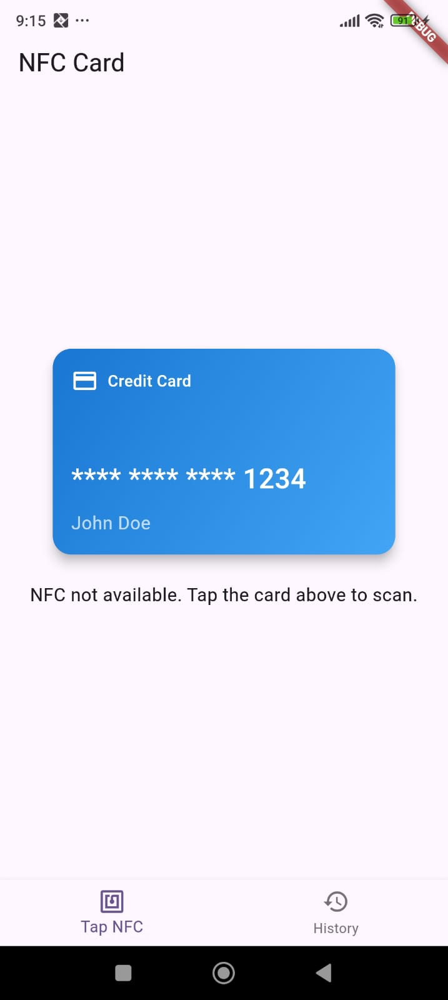

# NFC Card Scanner App

This Flutter app allows users to scan NFC cards and simulate card interactions in environments without NFC support. The app follows the MVVM architecture and integrates Firebase Firestore for real-time data storage.

## Features
- **NFC Card Scanning:** Tap NFC cards to read and store data.
- **Simulated Card Mode:** For devices without NFC, tap or long-press a card to simulate interactions.
- **Data Storage:** All interactions are stored in Firebase Firestore.

## Requirements
- Flutter SDK
- Android/iOS device with NFC support 
- Firebase account with Firestore enabled

## App Screenshots

### Tap Screen


### NFC data proceed Screen
.jpeg)


### history Screen
.jpeg)


## Directory Structure
```
├── lib
│   ├── main.dart             # Entry point of the app
│   ├── views                  # UI screens
│   ├── viewmodels             # Business logic
│   └── services               # Service integrations
├── pubspec.yaml               # Project configuration
```

## Contact
contact: [tushark200154@gmail.com]

---

